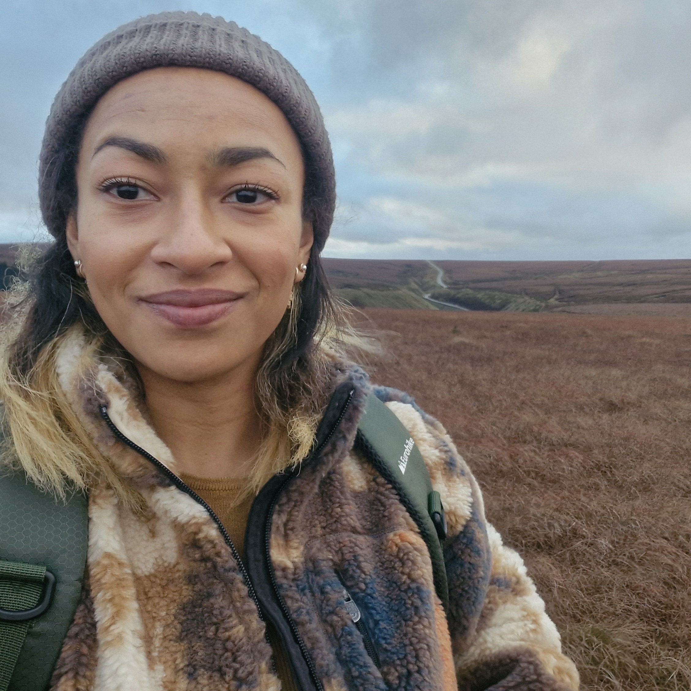
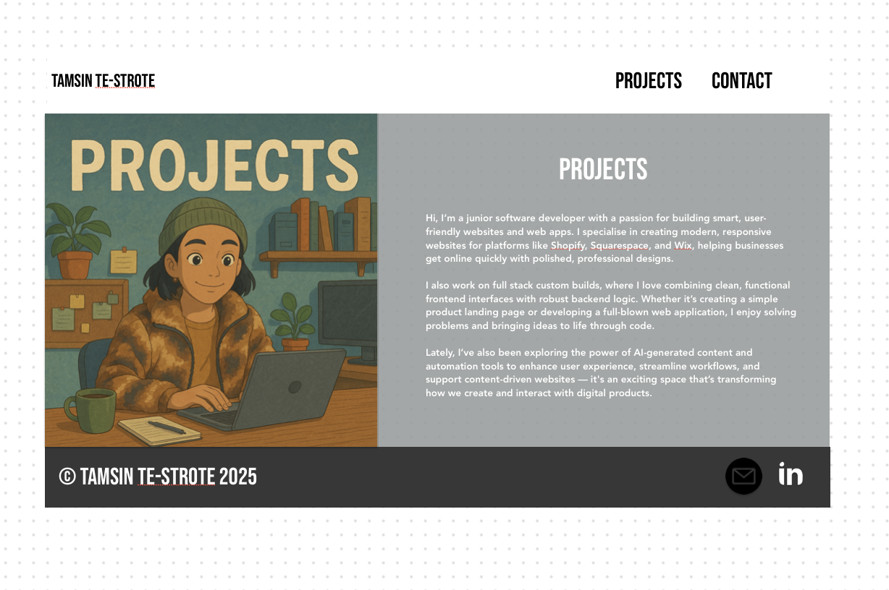

# Portfolio Project

## About Project

This portfolio showcases my web development skills, featuring both completed and ongoing projects. It's designed to appeal to recruiters, collaborators, and fellow developers by blending creativity with technical ability.

<a href="https://tambrulee.github.io/Portfolio_Project/index.html">Click here to view my deployed website in GitHub</a>

The site features an anime-inspired aesthetic, including a Studio Ghibli-style illustration generated via DALL·E through ChatGPT, based on a real-life photo of me.

Beyond web development, I’ve included design work to set myself apart—blending technical ability with creative flair and offering a glimpse of my personality.

The project was built using HTML5, CSS3, Bootstrap, and SCSS. While my use of SCSS is still developing, I plan to build on it in future work. Typography is set in Bebas Neue and Avenir, the former was sourced from Google Fonts.

**A picture of me that I converted into an AI image**

**Hero image for home page**

**Hero image for project page**

**Hero image for contact page**

## Built With

### Technologies
* **HTML5** - Basic website structure, semantic markup, and accessibility
* **CSS3** - General theme customization
* **Bootstrap** - Mobile responsive containers, navigation, footer, scrollspy, and accordion
* **SCSS** - Used for styling, particularly in customizing the theme and organizing styles more efficiently.

### Styling

* **Font Awesome** - Footer Icons
* **Google Fonts** - Importing Avenir & Bebas Neue
* **DALL-E** - AI-generated illustrations for a creative, personalized touch.

## User Stories

These user stories and acceptance criteria formed the foundation of the design. I aimed to keep the language and layout simple to cater to both technical and non-technical users. Clear call-to-action buttons guide users seamlessly between the homepage, projects, and contact pages.

GitHub links allow technical users to explore my code, while a LinkedIn link offers recruiters a quick way to review my resume and reach out.

The site is compact and efficiently designed, making it easy for visitors to learn about me and navigate to my work without feeling overwhelmed.

### 1. Hiring Manager Reviewing My Portfolio

**As a hiring manager**,  
I want to quickly understand the candidate’s technical skills, projects, and experience,  
So that I can determine if they are a good fit for the role.

**Acceptance Criteria:**
- A clear and concise "About Me" section.
- A well-organized list of projects with descriptions, technologies used, and links to code/demo.
- A section highlighting key skills and certifications.

### 2. Senior Developer Assessing My Code

**As a senior developer**,  
I want to review clean, well-structured code from the candidate’s projects,  
So that I can assess their coding ability and problem-solving skills.

**Acceptance Criteria:**
- Projects include a GitHub repository with well-documented README files.
- Code is formatted, commented, and follows best practices.
- A section describing challenges faced and solutions implemented.

### 3. Recruiter Looking for a Junior Developer

**As a recruiter**,  
I want to quickly scan the candidate’s experience and projects,  
So that I can decide whether to reach out for an interview.

**Acceptance Criteria:**
- A prominent section with key skills and technologies.
- A contact section with LinkedIn, email, and GitHub links.
- A visually appealing layout that is easy to navigate.

### 4. Fellow Developer Looking for Collaboration

**As a fellow developer**,  
I want to see if the candidate has open-source projects or shared interests,  
So that I can reach out for potential collaboration.

**Acceptance Criteria:**
- A section showcasing open-source contributions or side projects.
- Clear project descriptions with collaboration details.
- A way to contact the candidate or connect via GitHub.

### 5. Non-Technical Visitor Curious About My Work

**As a non-technical visitor**,  
I want to understand what the candidate does without needing deep technical knowledge,  
So that I can appreciate their skills and experience.

**Acceptance Criteria:**
- A simple, jargon-free introduction.
- Brief descriptions of projects with real-world applications.
- A visually engaging portfolio with screenshots or demos.

## Pages

### 1. Home / About Me

This is the landing page when the user first visits the website. It's split into three main sections: a hero image, a body of text describing me, and a banner showing icons of the coding languages I use.

I decided to use the Scrollspy feature after applying it to the Project page and liking the way it looked. In terms of UX, I thought it went well with the overall theme and made the information look nicely compact on the page.

**Wire Frames**

I drew up some rough wireframes. The final outcome came out quite close to the mockups, except it has a more compact layout with reduced whitespace. I also eventually decided to remove the badges as I struggled to place them in a way that would be mobile-optimized.

**Features:**
- Hero image
- A short bio  
- Key skills / tech stack badges  
- Call-to-action button that leads to Projects page

### 2. Projects

This second page of the website showcases some of my ongoing projects. It uses a scrollspy with a navigation bar, so viewers can easily find each project and learn more about it.

**Wire Frames**

**Features**
- A Bootstrap scrollspy window for easy navigation.
- Descriptions of each project, the technology used, and links to live demos or code repositories.

### 3. Contact / Connect

A quick, simple way for people to reach me or connect further.

**Wire Frames**

**Features:**
- A friendly message welcoming visitors to get in touch.
- My email address, LinkedIn, GitHub, and other social media links.

## Testing

### HTML Test

### CSS Test

No errors or issues found with CSS

### Lighthouse Test

I tested the website in lighthouse. Overall I was happy with the results, especially for accessibility. If I had more time I would look at the website performance, otherwise I'm happy that loading times and website speed is gernerally okay. 

#### Home Page - Lighthouse Test - Mobile

#### Home Page - Lighthouse Test - Desktop

#### Projects - Lighthouse Test - Mobile

#### Projects - Lighthouse Test - Desktop

#### Contact - Lighthouse Test - Mobile

#### Contact - Lighthouse Test - Desktop

### Mobile Responsiveness
I used the <a href="https://ui.dev/amiresponsive" target="_blank">Am I Responsive?</a> tool to test the mobile responsiveness of each of my web pages.

#### Home Page - Mobile Responsiveness

#### Projects Page - Mobile Responsiveness

#### Contact Page - Mobile Responsiveness

## Deployment

### Test 1
First deployment was unsuccessful. The index.html (Home) page was loading but the 'Project' and 'Contact' pages were not. I simply removed the '/' from in front of the file paths and tried again which worked.

### Test 2
As per above, the second attempt was successful and the website is no successfully deployed. Check it out here:

<a href="https://tambrulee.github.io/Portfolio_Project/index.html">Click here to view my deployed website in GitHub</a>

## Known Bugs

### Main navigation bar 
The navigation bar does not stretch all the way across the top of the screen at a 990px (min-width) and upwards resolution. This is an unintended glitch, but overall, it doesn't detract from the usability or the overall look of the website.

## Attribution

### Bootstrap
The portfolio heavily depends on Bootstrap for mobile responsiveness. The navigation, footer, containers, flex grids, scrollspy, and accordion all come from the Bootstrap library.
