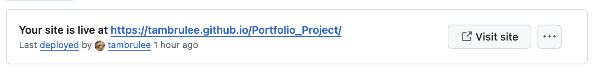

# Portfolio Project

## About Project

This portfolio showcases my web development skills, featuring both completed and ongoing projects. It's designed to appeal to recruiters, collaborators, and fellow developers by blending creativity with technical ability.

<a href="https://tambrulee.github.io/portfolio_project/">Click here to view my deployed website in GitHub</a>

The site features an anime-inspired aesthetic, including a Studio Ghibli-style illustration generated via DALL·E through ChatGPT, based on a real-life photo of me.

Beyond web development, I’ve included design work to set myself apart—blending technical ability with creative flair and offering a glimpse of my personality.

The project was built using HTML5, CSS3, Bootstrap, and SCSS. While my use of SCSS is still developing, I plan to build on it in future work. Typography is set in Bebas Neue (from Google Fonts) and Avenir.

**A picture of me that I converted into an AI image**

**Hero image for home page**

**Hero image for project page**

**Hero image for contact page**

## Built With

### Technologies
* **HTML5** - Basic website structure, semantic markup, and accessibility
* **CSS3** - General theme customization
* **Bootstrap** - Mobile responsive containers, navigation, footer, scrollspy, and accordion
* **SCSS** - Used for styling, particularly in customizing the theme and organizing styles more efficiently.

### Styling

* **Font Awesome** - Footer Icons
* **Google Fonts** - Importing Avenir & Bebas Neue
* **DALL-E** - AI-generated illustrations for a creative, personalized touch.

### Importing SCSS
For this project I imported SCSS. Although it isn't my first attempt, it is my first successful attempt.

#### Errors
It took several attempts to install SCSS successfully. I used npm/ sudo to load SCSS via the terminal on macOS. 

* First issue was that I was trying to load SCSS into the wrong directory - I changed directory and this seemed to work

* Second issue was use of incorrect syntax when trying to watch SCSS - resolved with the assistance of ChatGPT.

## User Stories

These user stories and acceptance criteria formed the foundation of the design. I aimed to keep the language and layout simple to cater to both technical and non-technical users. Clear call-to-action buttons guide users seamlessly between the homepage, projects, and contact pages.

GitHub links allow technical users to explore my code, while a LinkedIn link offers recruiters a quick way to review my resume and reach out.

The site is compact and efficiently designed, making it easy for visitors to learn about me and navigate to my work without feeling overwhelmed.

### 1. Hiring Manager Reviewing My Portfolio

**As a Hiring manager**,  
I want to quickly understand the candidate’s technical skills, projects, and experience,  
So that I can determine if they are a good fit for the role.

**Acceptance Criteria:**
- A clear and concise "About Me" section.
- A well-organized list of projects with descriptions, technologies used, and links to code/demo.
- A section hilighting key skills and certifications.

**UX Testing**

| Acceptance criteria | Met? (Y/N) | How criteria was met 
|:-----|:--------:|------:| 
| A clear and concise "About Me" section. | Y | Landing/home page immediately takes the user to a scrollable box on homepage which contains a professional summary, skills and a list of coding languages that I can work with. This allows them to assess whether or not I am am good fit before going further.| 
| A well-organized list of projects with descriptions, technologies used, and links to code/demo. | Y | Projects page uses a scrollspy function which lists all of my projects with decriptions of the work and technologies used with links to each project. This page can be reach via the navigation under 'Projects' or  there is a call-to-action button on the bottom of the homepage underneath my About Me as it makes sense that an interested hiring manager would logically want to see examples of projects next. | 
| A section highlighting key skills and certifications. | Y | As per above my key skills, certifications and coding languages are all within one scrollable container. I used a mix of paragraphs for my 'About Me' section and lists for skills and coding languages for better readability.| 

### 2. Senior Developer Assessing My Code

**As a senior developer**,  
I want to review clean, well-structured code from the candidate’s projects, so that I can assess their coding ability.

**Acceptance Criteria:**
- Projects include a GitHub repository with well-documented README files.
- Code is formatted, commented, and follows best practices.

**UX Testing**

| Acceptance criteria | Met? (Y/N) | How criteria was met 
|:-----|:--------:|------:| 
| Projects include a GitHub repository with well-documented README files. | Y | There are three projects one which is a GitHub based project with a README file, one is a Shopify project and the final website is one I did pro bono| 
| Code is formatted, commented, and follows best practices. | Y | The user can check out GitHub project via the Projects page or via Contacts under 'Check out my work' to view my code and assess whether or not it is up to the standard expected for a new hire| 

### 3. Recruiter Looking for a Junior Developer

**As a recruiter**,  
I want to quickly scan the candidate’s experience and projects,  
So that I can decide whether to reach out for an interview.

**Acceptance Criteria:**
- A prominent section with key skills and technologies.
- A contact section with LinkedIn, email, and GitHub links.
- A visually appealing layout that is easy to navigate.

**UX Testing**

| Acceptance criteria | Met? (Y/N) | How criteria was met 
|:-----|:--------:|------:| 
| A prominent section with key skills and technologies. | Y | As per above, Home Page gives user an overview of key skills and technologies| 
| A contact section with LinkedIn, email, and GitHub links. | Y | Contact page with accordian that makes it clear how best to get in touch with options given to view my LinkedIn profile, follow a link which opens a new email template with my email as the default recipient or sends them to my GitHub repositories.| 
| A visually appealing layout that is easy to navigate. | Y | It is a very modern three page website but with a simple and user friendly design - a bit of user interaction with scrollspy and accordian. Navigation is right at the top, although collapsed and hidden by the burger dropdown icon in mobile and tablet views. The website demonstrates a good knowledge of working with HTML, SCSS and Bootstrap without overwhelming a non-technical user|

### 4. Fellow Developer Looking for Collaboration

**As a fellow developer**,  
I want to see if the candidate has open-source projects or shared interests,  
So that I can reach out for potential collaboration.

**Acceptance Criteria:**
- A section showcasing open-source contributions or side projects.
- Clear project descriptions with collaboration details.
- A way to contact the candidate or connect via GitHub.

**UX Testing**

| Acceptance criteria | Met? (Y/N) | How criteria was met 
|:-----|:--------:|------:| 
| A section showcasing open-source contributions or side projects. | Y | There is a CTO button on the homepage that leads to the Projects page. I don't have any open-source contributions or side-projects for collaboration momentarily, however I've input placeholders for future projects and provided links to my GitHub.| 
| Brief descriptions of projects with real-world applications. | Y | Descriptions of projects given on Projects page with highlights which include features of projects, platforms and languages used. Links are provided for Developers to click through to - these are real projects of mine. | 
| A way to contact the candidate or connect via GitHub. | Y | Links to GitHub are provided on the Footer of the website, on the Projects and Contacts pages.|

### 5. Non-Technical Visitor Curious About My Work

**As a non-technical visitor**,  
I want to understand what the candidate does without needing deep technical knowledge,  
So that I can appreciate their skills and experience.

**Acceptance Criteria:**
- A simple, jargon-free introduction.
- Brief descriptions of projects with real-world applications.
- A visually engaging portfolio with screenshots or demos.

**UX Testing**

| Acceptance criteria | Met? (Y/N) | How criteria was met 
|:-----|:--------:|------:| 
| A simple, jargon-free introduction. | Y | Homepage intro start by letting the user know this is a website for my Software Development portfolio: 'Hi, I’m a junior software developer with a passion for building smart, user-friendly websites and web apps.'. The text that follows is slightly more technical, but presumes a basic level of knowledge of software development and would only be of interest to someone with technical knowledge.| 
| Brief descriptions of projects with real-world applications| Y | Description of each project is given with what each website features in laymans terms. | 
| A visually engaging portfolio with screenshots or demos.| N | No screenshots or demos used, but links provided. Will be consider for future updates.|

## Wire Frames

I drew up some rough wireframes. The final outcome came out quite close to the mockups, except it has a more compact layout with reduced white space. I also eventually decided to remove the badges as I struggled to place them in a way that would be mobile-optimized.

## Pages

### 1. Home / About Me

This is the landing page when the user first visits the website. It's split into three main sections: a hero image, a body of text describing me, and a banner showing icons of the coding languages I use.

I decided to use the Scrollspy feature after applying it to the Project page and liking the way it looked. In terms of UX, I thought it went well with the overall theme and made the information look nicely compact on the page.

I designed the homepage so that the spyscroll buttons are hidden as I felt they were redundant as there was not enough content especially within the desktop view. 

**Features:**
- Hero image
- A short bio  
- Key skills / tech stack badges  
- Call-to-action button that leads to Projects page

### 2. Projects

This second page of the website showcases some of my ongoing projects. It uses a scrollspy with a navigation bar, so viewers can easily find each project and learn more about it.

**Features**
- A Bootstrap scrollspy window for easy navigation.
- Descriptions of each project, the technology used, and links to live demos or code repositories.

### 3. Contact / Connect

A quick, simple way for people to reach me or connect further.

**Features:**
- A friendly message welcoming visitors to get in touch.
- My email address, LinkedIn, GitHub, and other social media links.

## Testing

### Userability Testing

#### Nav Links
| Link Title |  Page | Action | Outcome |
|:-----|:--------:|------:| ------:|
| Tamsin Te-Strote | Home | Open to home page | Working |
| Projects | Home | Open to projects page | Working |
| Contact | Home | Open to contact page | Working |
| Tamsin Te-Strote | Projects | Open to home page | Working |
| Projects | Projects | Open to projects page | Working |
| Contact | Projects | Open to contact page | Working |
| Tamsin Te-Strote | Contact | Open to home page | Working |
| Projects | Contact | Open to projects page | Working |
| Contact | Contact | Open to contact page | Working |

#### Call to action (C-T-O) buttons
| Button Title |  Page  | Action | Outcome |
|:-----|:--------:|------:| ------:|
| View my projects | Home | Open to projects page | Working |
| Contact Me | Projects | Open to contact page | Working |

#### Scrollspy
| Title |  Type  | Action | Outcome |
|:-----|:--------:|------:| ------:|
| GitHub | Link | Scrolls down to GitHub section | Working |
| Shopify | Link | Scrolls down to Luxury Bathrooms and Tiles section | Working |
| Hosting | Link | Scrolls down to Rising Up Ministries section | Working |
| Coming Soon | Link | Scrolls down to Coming Soon section | Working |
| Coming Soon | Link | Scrolls down to Coming Soon section | Working |
| Visit Website | Button | Opens GitHub repository in new tab | Working |
| Visit Website | Button | Opens Shopify project in new tab | Working |
| Visit Website | Button | Opens hosting project in new tab | Working |
| Visit Website | Button | Links back to projects page | Working |
| Visit Website | Button | Links back to projects page | Working |

#### Accordian - Contacts
| Title |  Type  | Action | Outcome |
|:-----|:--------:|------:| ------:|
| Work with me | Dropdown | Opens dropdown to email link | Working |
| Email me | Link | Opens up new email with linked email as recipients | Working |
| Connect Professionally | Dropdown | Opens dropdown to LinkedIn link | Working |
| LinkedIn | Link | Opens up Linked In page in new tab | Working |
| Check out my work | Dropdown | Opens dropdown to GitHub link | Working |
| GitHub | Link | Opens up GitHub page in new tab | Working |

### HTML Testing

* HTML was tested using: <a href="https://validator.w3.org/">Nu Html Checker</a>

#### Fixing Errors
Here's a list of errors flagged up by the W3 tester and how I fixed them:

* Removed '/' from all internal links to pages and files
* Closed main tag
* Closed all div elements
* Added spaces between attributes 

* Removed all duplicate IDs and replaced them with classes where appropriate

* Recoded all sections where there was a button tag nested within an a tag, so that it is an a tag with a button class so that CSS and styling are picked up.

#### Home Page - Issues Fixed

#### Projects Page - Issues Fixed

#### Contact Page - Issues Fixed

### CSS Testing

HTML was tested using: <a href="https://jigsaw.w3.org/css-validator/#validate_by_input" target="_blank">CSS Validation Service</a>

No errors or issues found with CSS

### Lighthouse Testing

I tested the website in lighthouse. Overall I was happy with the results, especially for accessibility. If I had more time I would look at the website performance, otherwise I'm happy that loading times and website speed is gernerally okay. 

#### Home Page - Lighthouse Test - Mobile

#### Home Page - Lighthouse Test - Desktop

#### Projects - Lighthouse Test - Mobile

#### Projects - Lighthouse Test - Desktop

#### Contact - Lighthouse Test - Mobile

#### Contact - Lighthouse Test - Desktop

### Mobile Responsiveness
I used the <a href="https://ui.dev/amiresponsive" target="_blank">Am I Responsive?</a> tool to test the mobile responsiveness of each of my web pages.

#### Home Page - Mobile Responsiveness

#### Projects Page - Mobile Responsiveness

#### Contact Page - Mobile Responsiveness

## Device & Browser Testing

### Device
- Website was tested on iPhone 7, iPhone 12 Max, Galaxy Z fold 5, Samsung Galaxy A1, iPad Mini/Air/Pro and Desktop
- There is some negative space on bottom of page in iPad Pro

### Browser
- Tested in Google Chrome, Safari, Microsoft Edge and Mozilla Firefox

## GitHub

### Connecting to GitHub via VS Code

- I opted to download GitHub Codespaces for ease instead of pushing and pulling manually via the terminal
- Once connected I could connect to my repositories in GitHub
- I used the interactive panel to do my commits and to push my commits to Git Hub

### Deployment

* First I created a folder for my project on my local hard drive and opened it within VS code
 

  

* Then I installed GitHub Codespaces into VS Code
 

  

* From there I was able to write my first few files. Write my commits and push my work via the interface in source control which provides easy to use commit, push and pull buttons.
 

  

* I could then check GitHub was updating with each push as expected. 
 

  

* To deploy the project I made my Github depository public under 'Settings' in my GitHub project. Right at the bottom of the page is the 'Danger Zone' I selected 'Change visibility' and set to 'Change to public'.

* Then I selected 'Pages' and 'Deploy from a Branch' under Source.

* Under 'Branch' I selected 'main', '/root' and then clicked 'Save'.

* From this point on the website has been deployed and will automatically update as I push my commits.

 

  

*  Here is my project deployed in GitHub. I did have some issues with setup at first, then after researching the issue I realised that my project was set to private to I  set it to public. Further issue images not showing and links going to a 404 page, this was resolved by removing the first '/' out of the links. 
 

#### Test 1
First deployment was unsuccessful. The index.html (Home) page was loading but the 'Project' and 'Contact' pages were not. I simply removed the '/' from in front of the file paths and tried again which worked.

#### Test 2
As per above, the second attempt was successful and the website is now successfully deployed. Check it out here:

<a href="https://tambrulee.github.io/portfolio_project/">Click here to view my deployed website in GitHub</a>

## Known Bugs

* Buttons for scrollspy on project page are slightly misaligned in mobile and tablet view

* Buttons have been hidden on homepage scrollspy

### Main navigation bar 
The navigation bar does not stretch all the way across the top of the screen at a 990px (min-width) and upwards resolution. This is an unintended glitch, but overall, it doesn't detract from the usability or the overall look of the website.

### Scrollspy buttons - Project page
Making the scrollspy buttons on the Project page disappear at 900px (min width) was a design choice as the container fit the screen and the buttons became redundant.

## Attribution

### Bootstrap
The portfolio heavily depends on Bootstrap for mobile responsiveness. The navigation, footer, containers, flex grids, scrollspy, and accordion all come from the Bootstrap library.
